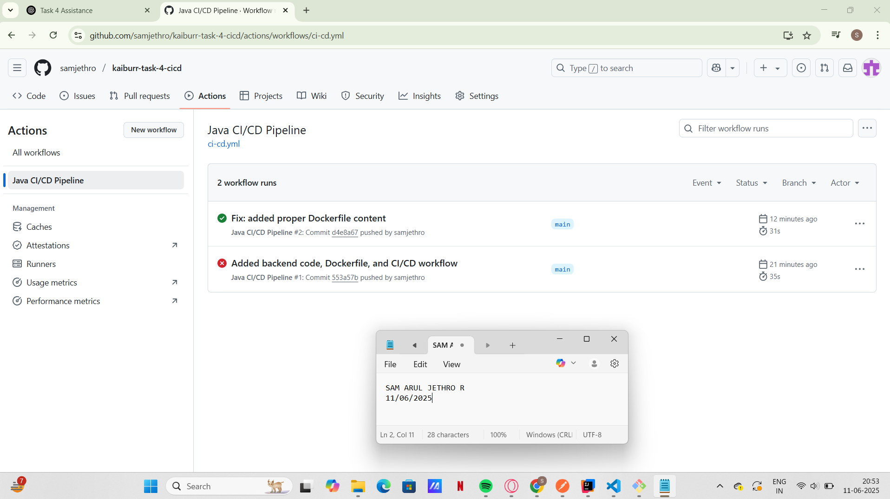

# Task 4 – CI/CD Pipeline

This project sets up a CI/CD pipeline for the Java backend using GitHub Actions.

## What it does
- Builds the Java backend using Maven
- Builds a Docker image from the project

## Screenshot

**Name: Sam Arul Jethro R**  

